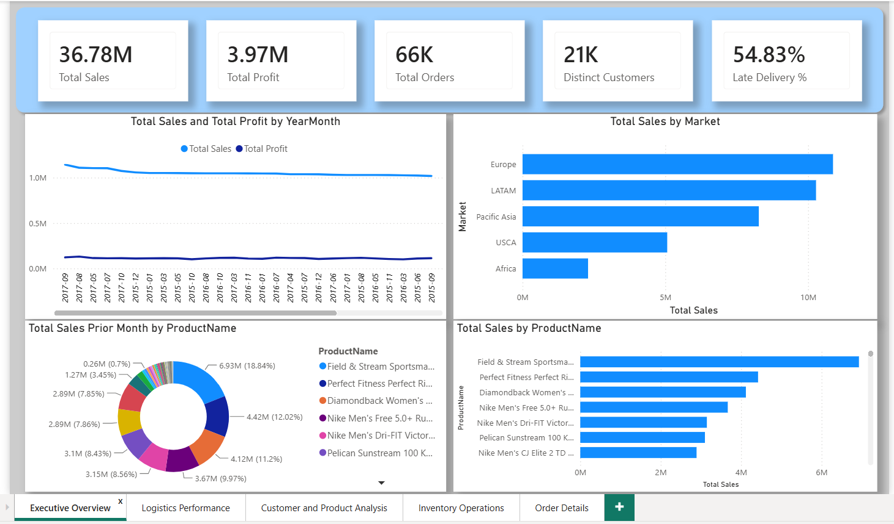
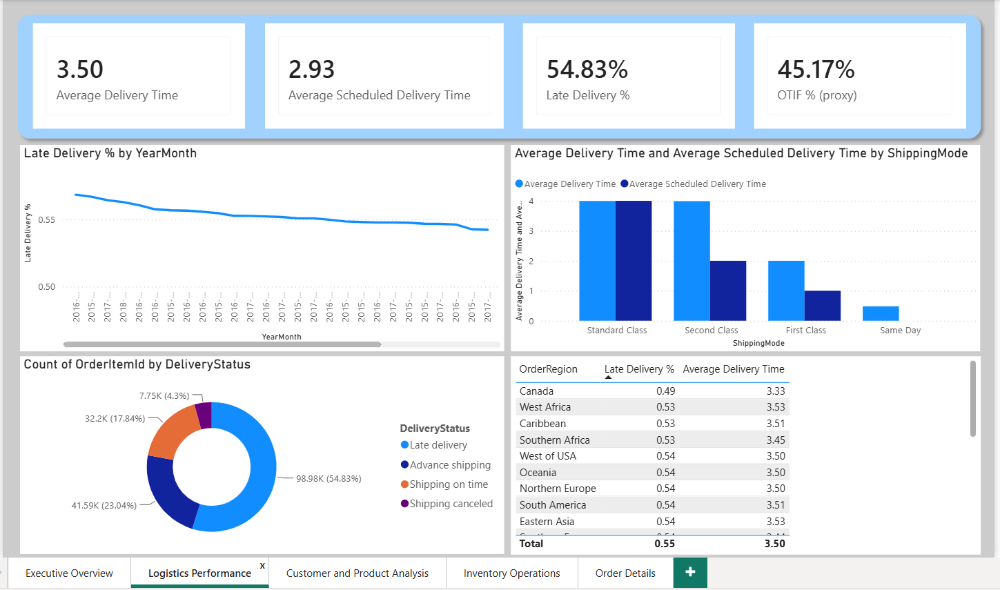
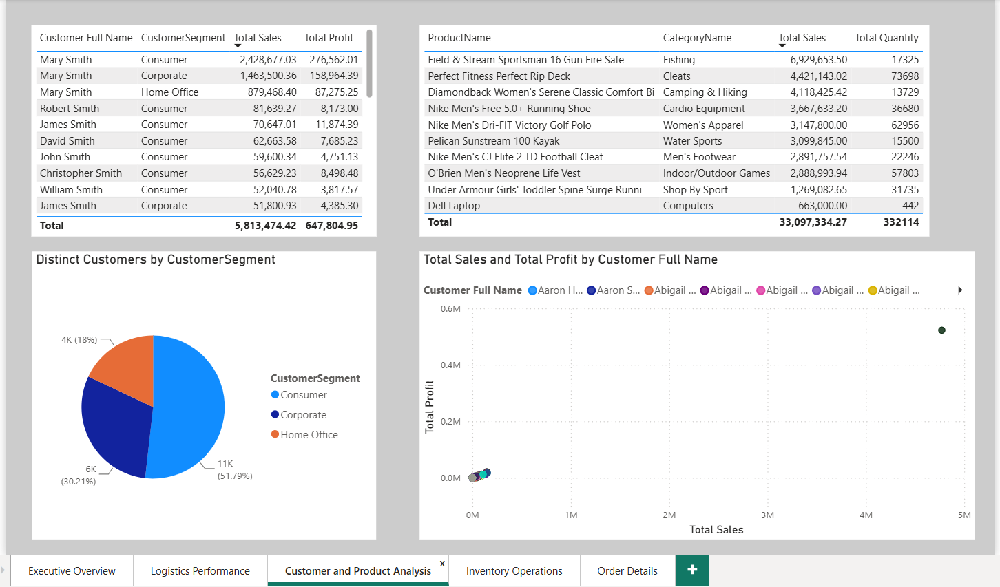
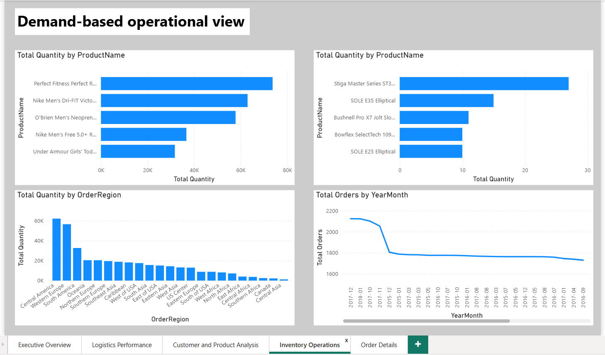
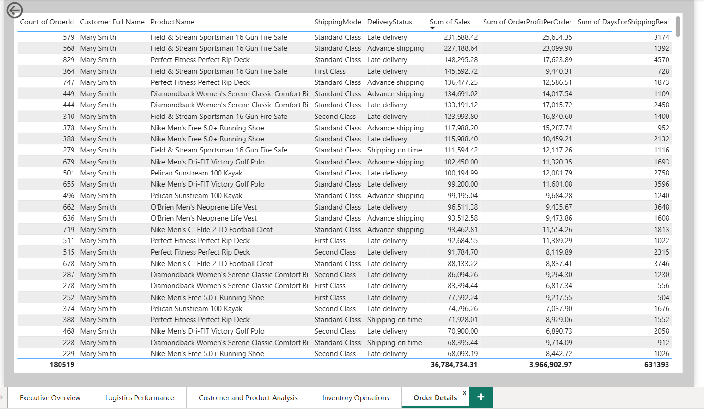

<div align="center">

# 📦 Supply Chain Dashboard

### 🚚 End-to-End Supply Chain Analytics Dashboard built with Power BI

Transforming raw supply chain data into actionable business insights through interactive dashboards and data visualization.


</div>

---

# 📖 Overview

This project presents an interactive **Supply Chain Dashboard** developed in **Power BI** to monitor and analyze key supply chain operations.

The dashboard enables stakeholders to track business performance using KPIs related to sales, inventory, shipping, supplier performance, production, and profitability. It transforms raw operational data into meaningful insights that support strategic decision-making.

---

# 🎯 Objectives

- Analyze overall supply chain performance
- Monitor sales and revenue trends
- Evaluate supplier efficiency
- Track shipping performance
- Identify inventory bottlenecks
- Improve operational decision-making through visualization

---

# 📊 Dashboard Features

✅ Executive KPI Dashboard

- Total Revenue
- Total Profit
- Total Orders
- Average Delivery Time
- Inventory Status
- Supplier Performance

---

✅ Sales Analysis

- Revenue Trends
- Product-wise Sales
- Regional Performance
- Category Analysis

---

✅ Inventory Analysis

- Current Inventory
- Stock Availability
- Low Stock Products
- Inventory Distribution

---

✅ Supplier Performance

- Supplier Ratings
- Delivery Performance
- Order Fulfillment
- Lead Time Analysis

---

✅ Shipping Analysis

- Shipping Mode Comparison
- Delivery Status
- Shipping Costs
- Delivery Time Trends

---

# 🛠️ Tech Stack

| Tool | Purpose |
|------|----------|
| Power BI | Dashboard Development |
| Power Query | Data Cleaning & ETL |
| DAX | KPIs & Calculated Measures |
| Excel / CSV | Data Source |

---

# 📈 Key Insights

The dashboard helps answer business questions such as:

- Which products generate the highest revenue?
- Which suppliers perform the best?
- Which shipping methods are most efficient?
- What regions contribute the highest sales?
- Where are inventory shortages occurring?
- How are profit margins changing over time?

---

# 📂 Repository Structure

```
Supply-Chain-Dashboard/
│
├── Dashboard.pbix
├── Dataset/
├── Images/
├── README.md
└── Screenshots/
```

---

# 📷 Dashboard Preview

<h3 align="center">Executive Overview</h3>

<p align="center">
  
</p>

---

<h3 align="center">Logistics Performance</h3>

<p align="center">
  
</p>

---

<h3 align="center">Customer & Product Analysis</h3>

<p align="center">
  
</p>

---

<h3 align="center">Inventory Operations</h3>

<p align="center">
  
</p>

---

<h3 align="center">Order Details</h3>

<p align="center">
  
</p>
# 🚀 Getting Started

1. Clone this repository

```bash
git clone https://github.com/Optimus0205/Supply-Chain-Dashboard.git
```

2. Open the `.pbix` file using **Microsoft Power BI Desktop**

3. Refresh the data (if required)

4. Explore the dashboard using interactive filters and slicers

---

# 📌 Skills Demonstrated

- Data Cleaning
- Data Modeling
- Power Query
- DAX
- Dashboard Design
- Data Visualization
- KPI Development
- Business Intelligence
- Supply Chain Analytics

---

# 📚 Business Metrics

- Revenue
- Profit
- Orders
- Inventory
- Shipping Cost
- Delivery Time
- Supplier Performance
- Product Performance
- Regional Sales
- Order Status

---

# 💡 Future Improvements

- Forecasting using Time Series
- Demand Prediction
- Inventory Optimization
- Real-time Data Integration
- Customer Segmentation
- Advanced DAX Measures

---

<div align="center">

# 👨‍💻 Author

**Ashutosh Singh**

Aspiring Data Scientist | Machine Learning | Deep Learning | Power BI | Data Analytics

GitHub:
https://github.com/Optimus0205

---

# ⭐ Support

If you found this project useful, consider giving it a ⭐ on GitHub!

It helps others discover the project and motivates future improvements.

---

### Thanks for visiting! 🚀

</div>
